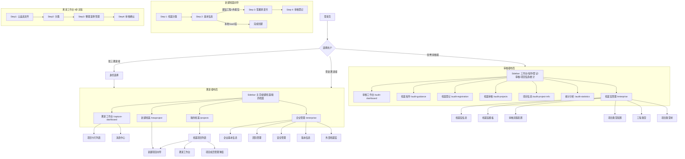
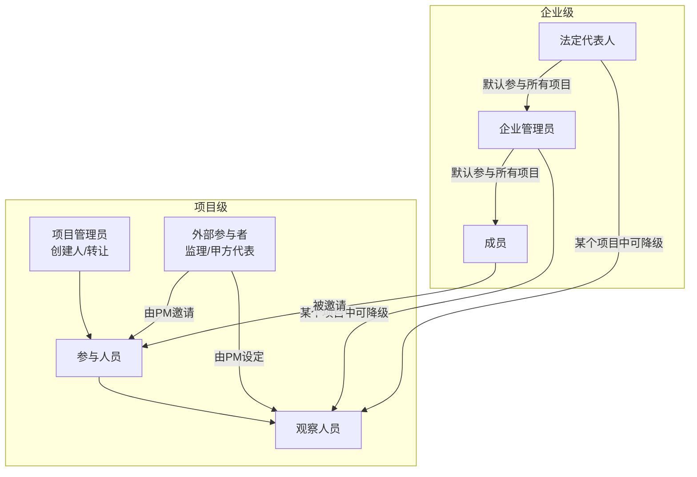
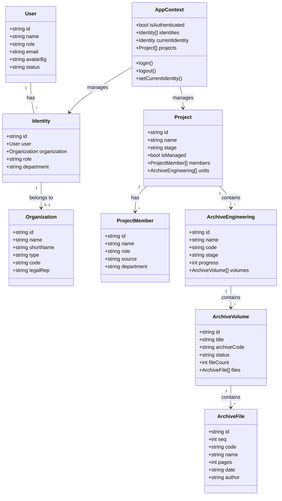
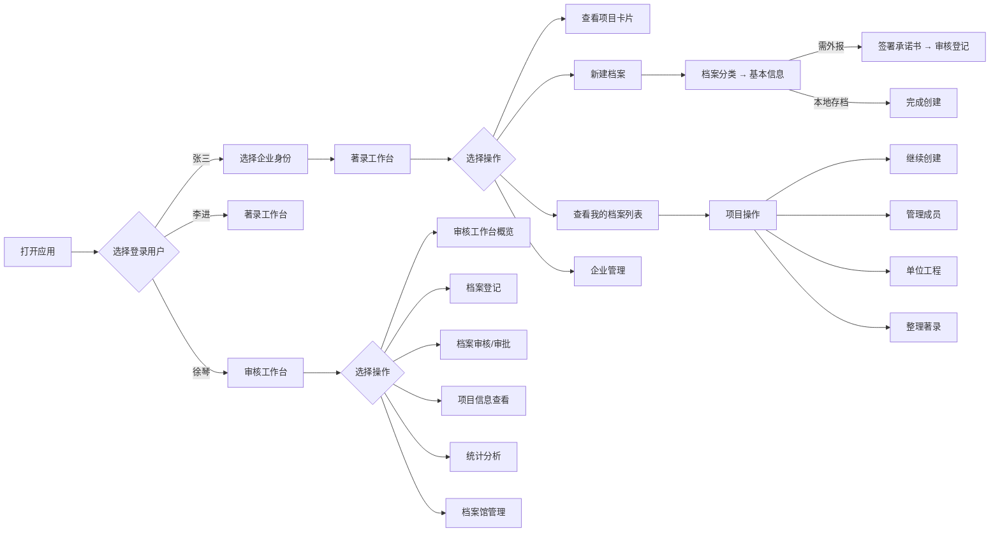

# LantaiCloud 业务逻辑图

## 1. 整体架构流程

---

## 2. 角色体系

参见 `AGENTS.md`，核心角色关系：

---

## 3. 数据模型关系

---

## 4. 用户操作流程

---

## 模块路由总览

| 端侧 | 模块 | 路由 | 核心功能 |
|------|------|------|---------|
| 著录 | 著录工作台 | `/capture-dashboard` | 项目卡片、消息中心 |
| 著录 | 新建档案 | `/newproject` | 分步向导：分类→信息→承诺书→审核 |
| 著录 | 我的档案 | `/projects` | 项目列表、成员管理、单位工程 |
| 著录 | 企业管理 | `/enterprise` | 信息、团队、安全、版本、外部档案馆 |
| 审核 | 审核工作台 | `/audit-dashboard` | 概览、统计、待办 |
| 审核 | 档案登记 | `/audit-registration` | 移交登记核对 |
| 审核 | 档案审核 | `/audit-projects` | 树形审批、问题追踪 |
| 审核 | 项目信息 | `/audit-project-info` | 审计项目详情 |
| 审核 | 档案指导 | `/audit-guidance` | 国家标准说明 |
| 审核 | 统计分析 | `/audit-statistics` | 统计图表 |
| 审核 | 档案馆管理 | `/enterprise` | 档案馆信息、模板、流程、类型 |
| 通用 | 个人设置 | `/settings` | 资料、账号、通知、安全 |
