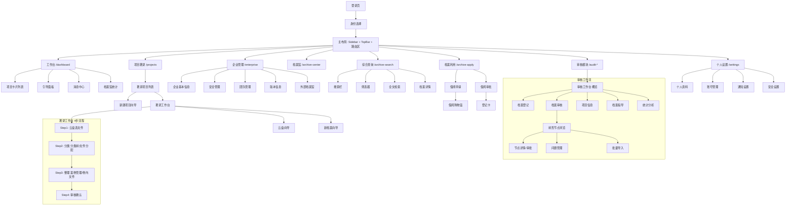
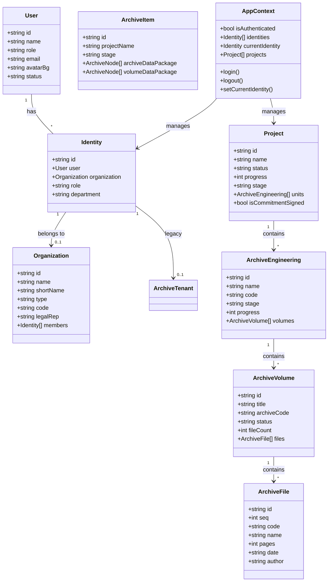
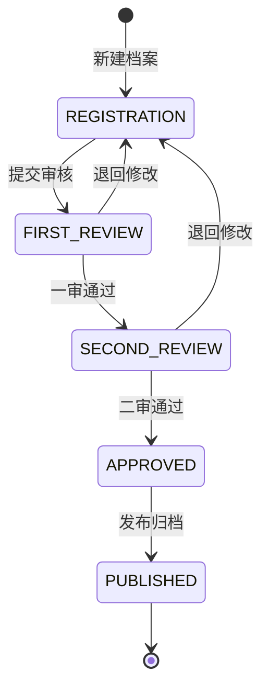
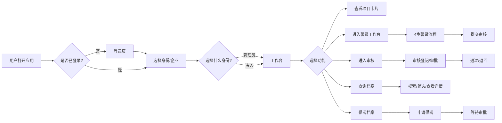

# LantaiCloud 业务逻辑图

## 1. 整体架构流程

---

## 2. 数据模型关系

---

## 3. 审核工作流状态

---

## 4. 用户操作流程 (主要路径)

---

## 模块总览

| 模块 | 路由 | 核心功能 |
|------|------|---------|
| 工作台 | /dashboard | 项目卡片、引导、消息、统计 |
| 项目著录 | /projects | 著录列表、4步著录流程、多步骤向导 |
| 企业管理 | /enterprise | 企业信息、团队、安全、版本 |
| 档案馆 | /archive-center | 归档/借阅统计 |
| 综合查询 | /archive-search | 搜索、筛选、全文检索 |
| 档案利用 | /archive-apply / -approve | 借阅申请、审批、购物篮 |
| 审核模块 | /audit-* | 登记、审核(树/节点)、指导、统计 |
| 个人设置 | /settings | 资料、账号、通知、安全 |
